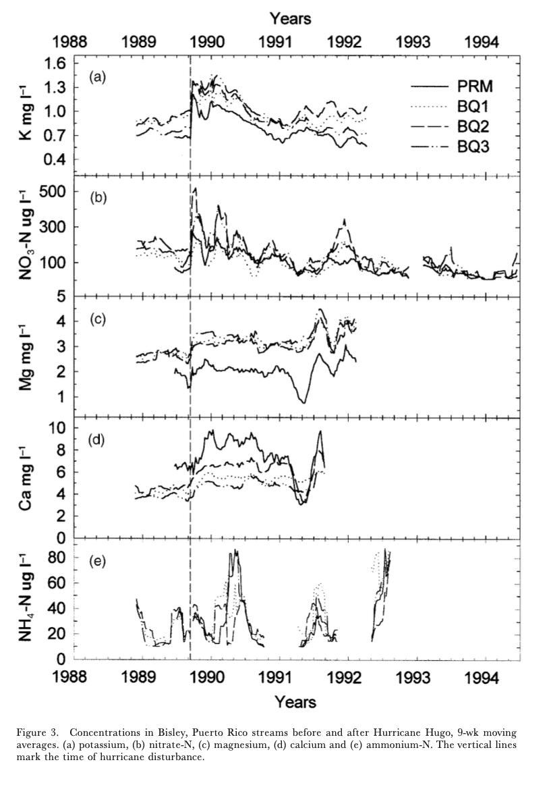

# Final Project for EDS214

### Background

This Repository contains the code that will take the data and reproduce the hurricane effects on stream chemistry from the paper “Effects of Hurricane Disturbance on Stream Water Concentrations and Fluxes in Eight Tropical Forest Watersheds of the Luquillo Experimental Forest, Puerto Rico.”

{width="344"}

### Content

There are folders that contains the followings:

[data](https://github.com/jwonyk/EDS214-Schaefer-jwonyk/tree/main/data/raw): Raw Data

[docs](https://github.com/jwonyk/EDS214-Schaefer-jwonyk/tree/main/docs): HTML that holds all the information of finalized products

[figs](https://github.com/jwonyk/EDS214-Schaefer-jwonyk/tree/main/figs): Data Visualization

[R](https://github.com/jwonyk/EDS214-Schaefer-jwonyk/tree/main/R): A Script(s) that holds the supporting code

[paper](https://github.com/jwonyk/EDS214-Schaefer-jwonyk/tree/main/paper): This folder holds the finalized analysis script

### Analysis

{width="1053"}

0.  [initialization.R](https://github.com/jwonyk/EDS214-Schaefer-jwonyk/blob/main/00_Initialization.R)
    -   This script includes all the packages that needs to be install to run this project. Please open and go install if needed.
1.  [data_cleaning.R](https://github.com/jwonyk/EDS214-Schaefer-jwonyk/blob/main/01_data_cleaning.R)
    -   Data cleaning is completed and produce output to output folder from this script.
2.  [plot.R](https://github.com/jwonyk/EDS214-Schaefer-jwonyk/blob/main/02_plot.R)
    -   This script will produce visualization.
3.  [flowchart_final.R](https://github.com/jwonyk/EDS214-Schaefer-jwonyk/blob/main/03_flowchart_final.R)
    -   This script will generate the flowchart that is used for this README.md

### Output

{width="728"}

### References

McDowell, W. and International Institute of Tropical Forestry(IITF), USDA Forest Service.. 2024. Chemistry of stream water from the Luquillo Mountains ver 4923064. Environmental Data Initiative. <https://doi.org/10.6073/pasta/f31349bebdc304f758718f4798d25458> (Accessed 2025-08-29).

Schaefer, Douglas. A., William H. McDowell, Fredrick N. Scatena, and Clyde E. Asbury. 2000. “Effects of Hurricane Disturbance on Stream Water Concentrations and Fluxes in Eight Tropical Forest Watersheds of the Luquillo Experimental Forest, Puerto Rico.” Journal of Tropical Ecology 16 (2): 189–207. <https://doi.org/10.1017/s0266467400001358>.
